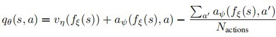
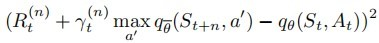
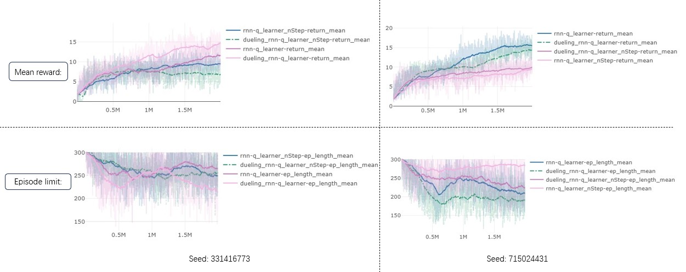

## Abstract

In a lot of real-life scenarios where AI is potential to be applied, people need to control multiple agents that exist at the same time to accomplish a specific task like multiplayer online games, robot collaboration and so on. In terms of the reinforcement learning (RL) field, much relevant research has gradually extended from  single-agent learning to multi-agent reinforcement learning (MARL). This dissertation presents an attempt to extend  QMix, a popular MARL algorithm, using the techniques of multi-step learning and dueling network. 

To achieve this, this project was built upon a clearly-structured codebase, PyMARL [1], which implement several MARL algorithms including QMix. Based on that, the target q function and the agent network part in PyMARL were replaced by multi-step learning and dueling network respectively.

Experiments and evaluation were taken to access the performance of the extended algorithm. These two type of extensions as well as their combination show the impact in grid world predator-prey tasks like reduce the training time. However, worse reward value was obtained with some parameter configurations in comparison with using the original QMix. It turns out that different envionment configuration and different choices of the hyperparameters in algorithm setting are crucial factor of the final performance. With appropriate adjustments to the setting, the extended algorithms have potential to be practical in simple multi-agent task environment.


## Statement of Ethical Compliance

This project strictly follows the University of Liverpool's ethical guidance. 

* The project is planed to be built on top of the open-sourced PyMARL framework [1] (https://github.com/oxwhirl/pymarl) and use programming language Python and PyTorch framework. Also, this project borrows the idea from part of the content in WQmix [2]\(https://github.com/oxwhirl/wqmix), which is an extended version of PyMARL.
* No Human subjects, human tissue and animals are involved. Data used in this project are refered from open-sourced PyMARL framework [1] and open-sourced WQMIX framework [2].
* The data categories and human participant categories of this project is A0. There is neither use of data derived from humans or animals nor any use of human participants in any activity. The data is generated by running deep multi-agent reinforcemnet learning algorithms in simulation environments.
* No real data from participants is used in evaluation stage.
* There is not anyone who is offered money, prizes or other financial inducements to take part in this project.

<div style="page-break-after:always"></div

## Table of Contents

<div style="display: flex;">     <div style="flex-grow: 1; text-align: left;">         <strong>1.Introduction & Background</strong>     </div>     <div style="text-align: right;">         5&emsp;&emsp;     </div> </div>

<div style="display: flex;">
   	<div style="flex-grow: 1; text-align: left;">
        &emsp;&emsp;1.1. Introduction 
    </div>
    <div style="text-align: right;">
        5&emsp;&emsp;
    </div>
</div>

<div style="display: flex;">
   	<div style="flex-grow: 1; text-align: left;">
        &emsp;&emsp;1.2. Aims and Objectives 
    </div>
    <div style="text-align: right;">
        7&emsp;&emsp;
    </div>
</div>

<div style="display: flex;">     <div style="flex-grow: 1; text-align: left;">         <strong>2. Design </strong>     </div>     <div style="text-align: right;">         7&emsp;&emsp;     </div> </div>

<div style="display: flex;">
   	<div style="flex-grow: 1; text-align: left;">
        &emsp;&emsp;2.1. PyMARL structure 
    </div>
    <div style="text-align: right;">
        7&emsp;&emsp;
    </div>
</div>

<div style="display: flex;">
   	<div style="flex-grow: 1; text-align: left;">
        &emsp;&emsp;2.2. extension: multi-step learning
    </div>
    <div style="text-align: right;">
        8&emsp;&emsp;
    </div>
</div>

<div style="display: flex;">
   	<div style="flex-grow: 1; text-align: left;">
        &emsp;&emsp;2.3. extension: dueling network 
    </div>
    <div style="text-align: right;">
        9&emsp;&emsp;
    </div>
</div>

<div style="display: flex;">
   	<div style="flex-grow: 1; text-align: left;">
        &emsp;&emsp;2.4. Predator-prey environment building
    </div>
    <div style="text-align: right;">
        10&emsp;&emsp;
    </div>
</div>

<div style="display: flex;">
   	<div style="flex-grow: 1; text-align: left;">
        &emsp;&emsp;	2.5. Data storage and visulisation 
    </div>
    <div style="text-align: right;">
        11&emsp;&emsp;
    </div>
</div>

<div style="display: flex;">     <div style="flex-grow: 1; text-align: left;">         <strong>3. Implementation </strong>     </div>     <div style="text-align: right;">         11&emsp;&emsp;     </div> </div>

<div style="display: flex;">
   	<div style="flex-grow: 1; text-align: left;">
        &emsp;&emsp;	3.1. Project Framework & Localization 
    </div>
    <div style="text-align: right;">
        11&emsp;&emsp;
    </div>
</div>

<div style="display: flex;">
   	<div style="flex-grow: 1; text-align: left;">
        &emsp;&emsp;	3.2. multi-step learning
    </div>
    <div style="text-align: right;">
        12&emsp;&emsp;
    </div>
</div>

<div style="display: flex;">
   	<div style="flex-grow: 1; text-align: left;">
        &emsp;&emsp;	3.3. dueling network 
    </div>
    <div style="text-align: right;">
        15&emsp;&emsp;
    </div>
</div>

<div style="display: flex;">
   	<div style="flex-grow: 1; text-align: left;">
        &emsp;&emsp;	3.4. running environment
    </div>
    <div style="text-align: right;">
        18&emsp;&emsp;
    </div>
</div>

<div style="display: flex;">
   	<div style="flex-grow: 1; text-align: left;">
        &emsp;&emsp;	3.5.  hyper-parameter tuning
    </div>
    <div style="text-align: right;">
        19&emsp;&emsp;
    </div>
</div>

<div style="display: flex;">     <div style="flex-grow: 1; text-align: left;">         <strong>4. Testing & Evaluation</strong>     </div>     <div style="text-align: right;">         19&emsp;&emsp;     </div> </div>

<div style="display: flex;">
   	<div style="flex-grow: 1; text-align: left;">
        &emsp;&emsp;	4.1. Expected result 
    </div>
    <div style="text-align: right;">
        19&emsp;&emsp;
    </div>
</div>

<div style="display: flex;">
   	<div style="flex-grow: 1; text-align: left;">
        &emsp;&emsp;	4.2. Result & Analysis 
    </div>
    <div style="text-align: right;">
        20&emsp;&emsp;
    </div>
</div>

<div style="display: flex;">     <div style="flex-grow: 1; text-align: left;">         <strong>5. Project Ethics </strong>     </div>     <div style="text-align: right;">         23&emsp;&emsp;     </div> </div>

<div style="display: flex;">     <div style="flex-grow: 1; text-align: left;">         <strong>6. Conclusion & Future Work </strong>     </div>     <div style="text-align: right;">         23&emsp;&emsp;     </div> </div>

<div style="display: flex;">
   	<div style="flex-grow: 1; text-align: left;">
        &emsp;&emsp;	6.1. Conclusion
    </div>
    <div style="text-align: right;">
       23&emsp;&emsp;
    </div>
</div>

<div style="display: flex;">
   	<div style="flex-grow: 1; text-align: left;">
        &emsp;&emsp;	6.2. Future Work
    </div>
    <div style="text-align: right;">
        23&emsp;&emsp;
    </div>
</div>

<div style="display: flex;">     <div style="flex-grow: 1; text-align: left;">         <strong>7. BCS Criteria & Self-Reflection </strong>     </div>     <div style="text-align: right;">         23&emsp;&emsp;     </div> </div>

<div style="display: flex;">     <div style="flex-grow: 1; text-align: left;">         <strong>References </strong>     </div>     <div style="text-align: right;">         25&emsp;&emsp;     </div> </div>

<div style="display: flex;">     <div style="flex-grow: 1; text-align: left;">         <strong>Appendices </strong>     </div>     <div style="text-align: right;">         26&emsp;&emsp;     </div> </div>

<div style="page-break-after:always"></div>

## 1. Introduction & Background

### 1.1. Introduction

Reinforcement Learning (RL) is capable to help address various cooperative tasks, e.g., in traffic light control [3] and autonomous cars [4]. QMix is such an MARL that extends DQN to a multi-agent reinforcement learning environment.


**DQN and its extension:** 

DQN is a popular single-agent deep reinforcement learning algorithm [5]. It extends the standard tabular Q-learning algorithm with deep learning to become more powerful.  The action-value function in DQN is represented with a deep neural network parameterised by *θ*. Also, a *replay memory* is used to keep the transition information. 

As mentioned before, Rainbow extends DQN with different simple techniques. Specifically,  the extension with n-step learning and dueling networks are two examples for this project to extending QMIX from a single-agent layer to the mult-agent layer. The paper published by Rainbow [6] explains how they implemented these techniques on DQN and the basic of idea of them. 


**Dueling networks**: 

It is a neural network architecture specially desined for value-based RL. There are two streams of computation. One for value and one for advantage sharing the same convolutional encoder. They are eventually merged by a specialised aggregator [6]: 



*ξ*, *η*, and *ψ* here coorespond to the parameters of the shared encoder, of the value stream, and of the advantage stream respectively. θ is the concatenation of them[6].


**Multi-step learning**: 

It is also call n-step learning. In comparison with normal RL methods, it looks forward for n steps when estimating target value. Correspondingly, the reward is accumulated from more states ahead. The truncated *n*-step return from a given state *S*~t~ is defined as [6]:


There is also a multi-step variant of DQN defined by minimizing the alternative loss [6]:



These two techniques, dueling networks and n-step learning are integrated into QMIX in a multi-agent environment in this project.


**QMix:**

According to the paper published by Rashid et al. (2018)[7], the difference between QMIX and other algorihtms mainly performs on how to represent and use the action-value function which is a widely involved concept in most RL methods. One extreme is to directly learn decentralised value function and polices which *Independent Q-learning* [8] follows. Another extreme is centralised learning like how centralised Q-learning does. QMIX lies between them. It can train decentralised policies in a centralised fashion employing neural network. The general structure is shown in Figure 1 [7] below. The action-value function is represented by Q.


<center style="font-size:11px;color:#0C0C0C">figure1. QMix structure: agent network and mixer network</center>


For consistency, what we need to ensure is that a golbal *argmax* which is perform on Q~tot~ equals to what  a set of individual *argmax* operations performed on each Q~a~:


For each agent a, there is a individual value funtion Q~a~($\tau$^a^, u^a^) represented by corresponding agent network. As illustrated in Figure 2c, at each time step, the network receives the current individual observation O~t~^a^  and the last action u~t-1~^a^ as input.

Mixing network takes the agent network outputs as input and mixes them monotonically. Like what Figure 2a shows, the values of Q~tot~ are then produced. The restriction is to set the weight to be non-negative to achieve the monotonicity on the relationship between Q~tot~ and each Q~a~: 


As for the weights of the mixing network, it is generated with seperate hypernetworks. It can be found that the state s is taken as input by each hypernetwork and output the weights of one layer of the mixing network. Each hypernetwork contains a single linear layer with a absolute activation function. Then a vector is generated which is reshaped into a matrix of appropriate size. As shown in Figure 2a, there are 2 layers in total.

In terms of the objective function of this algorithm, QMIX is trained by minimising the following loss: 


**Test envionment**:

Predator-prey task is a simple cooperative task that is commonly used to evaluate reinforcement learning algorithm.Interactions between predators and prey are similated to help understand the performance of deep learning models in complex dynamic environments.

W. Böhmer, V. Kurin, and S. Whiteson has built a grid-world predator-prey task in their project [9] which is worth learning. In this task, within a 10x10 grid, 8 agents are asked to hunt 8 prey. The action of agent can be either move towards 4 compass directions, keep motionless, or try to catch any ajacent pery. No position overlap is allowed. As for prey, they move ramdomly following a legal movement or remain still if all surrounding positions are occupied. A prey can be caught if two adjacent agents execute the *catch* action,  and both the the catching agents and the prey are then removed from the grid world. An agent’s observation is a 5 *×* 5 sub-grid centered around it capturing agents and prey. When all agents have been removed or after 200 time steps, the game ends. The reward *r* of capturing a prey is 10, but the punishment of unsuccessful attempts by single agents is a negative reward *p* [9].


### 1.2. Aims and Objectives

1. Extend QMIX with dueling networks.
2. Extend QMIX with multi-step learning.
3. Extend QMIX with multi-step learning together with dueling networks.
4. Test and evaluate the performance of original QMIX, QMIX plus dueling networks, QMIX plus multi-step learning, QMIX plus both dueling networks and dueling networks in predator-prey tasks.


## 2.Design

The main language used in this project to build the whole machine learning model and testing environment  is Python. One of the reasons is that python is a high-level language supporting rapid development. Moreover, Python has well-supported libraries for machine learning which also, to some extend, implies the existence of abundant resources for reference. Specifically, for this project, PyMARL[1] implement a complete MARL algorithm and test system mainly in python. 

PyTorch is a main library used by PyMARl and by this project as well. It is widely used machine-learning system develoment because of its flexibility, abundant commuty support, GPU speedup function and many other benefits. Tensor is a data structure defined in PyTorch that can store and process various types of data, including images, text, time series, etc., and are the basis of deep learning and machine learning algorithms.


### 2.1. PyMARL structure

The figure below demonstrates the brief structure of the original PyMARL[1], especially for the QMix algorihtm version. There is a *main.py* file managing a experiment object supported by the library -- sacred, so that most important configurations and results can be easily saved and managed. 

There's also a *run.py* file where we have the *run_sequential()* function which is the core part that run the experiments. It uses 4 important objects: MAC(multi-agent controller), runner, buffer and learner. In terms of the QMix algortihm, the core part of it has been implemented mainly in the learner.


<center style="font-size:11px;color:#0C0C0C">figure2. PyMARL structure</center>


### 2.2. extension: multi-step learning

The objective funtion (loss function) for this is:


where:


The optimization process is to minimise the loss by adjusting the network parametes. R~t~ plus $\gamma$~t~ is called TD-target which is, as the name implies, the target value that the neural network is supposed to generate for this state-action pair. As the loss gets smaller, the network is regarded to be trained better. It is precisely the same as what QMix does if we assume n to be 1. Therefore, we just need to define a tool funtion to calculate the n-step TD-target and then call it to replace the original TD-target within the q-learner part of code in PyMARL[1]. The new structure for the extension is presented in figure3 and the changed part is highlighted.


<center style="font-size:11px;color:#0C0C0C">figure3. structure: extension with multi-step learnings</center>


### 2.3. extension: dueling network

Agent network and mixer network are two crucial components of QMix. Agent network is where dueling network is implemented in this project for higher feasibility. 

The agent network in PyMARL[1] is a typical RNN agent model used in reinforcement learning, especially in environments where past information (history of states) needs to be considered to make decisions. Through the use of GRU, the model can effectively handle possible long-term dependencies, while the fully connected layer converts the output of RNN into specific action selections.

This extended version of the algorithm is supposed to decompose the value function into state values and advantage values so that the model can more effectively learn the relative importance of taking specific actions in different states. This can help improve performance in some complex decision-making environments. Theoretically, this structure should be able to help the agent better distinguish when changes in environmental state are more important than choosing which specific action to take, which is beneficial to learning stability.

This new agent network will be called by the multi-agent controller and then keep outputing the combined action value while the learner being trained during the iteration.


<center style="font-size:11px;color:#0C0C0C">figure4. structure: extension with dueling network</center>


### 2.4. Predator-prey environment building

Although PyMARL[1] itself do experiments under the environment of SMAC platform, this project choose to test the algorithm in simpler grid-world predator-prey tasks. Considering the codebase WQmix[2] is also built upon PyMARL and design a predator-prey environment for algorithm evaluation, it is practical to embed that part of code into my machine-learning system directly. The default configration of the project is altered so that this envionment would be called by the runner object in its *runner.env* property. Relevant parameter configuration is altered a little considering the discription of the project requirement and the recommendation from project supervisor.


### 2.5. Data storage and visulisation

When it comes to the experimental data storage, as the default setting in PyMARL[1], logging data is automatically saved to disk for sacred. Additionally, a document database management system, MongoDB, is linked to the logger so that the data of all experiments could be saved in this system. The benefit of using MongoDB is that there is a  web dashboard for the Sacred machine learning experiment management tool that work well together with MongoDB. In this way, data could be visualised easily and clearly. Furthermore, it support operations to data smoothing and algorithmic analyse and compare.


## 3. Implementation

According to the structure shown in the graphs in section2 (2. Design), these two techniques are planned to be implemented at two separate parts. Therefore, the whole implementation process can be seperated directly and when testing, we can combine them freely without worrying about any conflicts.


### 3.1. Project Framework & Localization

The first step before all extensions is to deploy the PyMARL[1] codebase, i.e., the original QMix code, as well as create an suitable python environment with all required libraries in the Windows10 system.

The python environment is established as a new Anaconda environment. Anaconda makes it possible to create multiple indenpendent virtual  environments with different version of packages such that the conflicts caused by different environments for different projects could be avoid, and the pakcages needed by each project could be managed in a more clear and precise mode. 

For this project, though PyMARL offers a "requirements.txt" file that indicates the required packages with version information, these requirements need to be treated carefully. In the first attempt when I allow my editor, PyCharm, to install all the libraries and dependencies strictly following this file, errors occur and it seems like they match a quite old version of python. My solution is to create a conda enviornment with python3.6, then manually install all packages required withoud indicating the version number. In this way, all libraries are installed automatially with version matching to python3.6. It is also mention-worthy that some libraries have nto been supported by python3.6 anymore, e.g., *enu34*. The function of it seems have been embeded into python3.6 itself, so the whole environment works well when I simply ignore it.

The default running environment of PyMARL is StarCraft II and SMAC. At this stage, the predator-prey environment has not been added. Therefore, I decided to set up SMAC first so that I can run a simple experiment to make sure the environment is set properly and can support the algorithms well. It took me a long time to successfully setting SMAC since when installing one of its dependency -- "*dm-tree*", there is always a error message. Finally, driven by my suspicion that SMAC’s description of dm-tree version requirements is wrong, I tried to install dm-tree ver.0.1.1 which turns out to be a suitable version for SMAC. A StarCraftII experiment can now run with QMix algorihtm.


### 3.2. multi-step learning

#### The First Attempt:

To extend QMix with n-step learning, the first try was to change the method of calculating TD-target starting from scratch, all based on my own understanding. The n-step TD-target consists of n-step rewards and n-step optimal q value. 

Figure5 illustrates how I try to calculate n-step rewards. According to the definition of R(n) which has been introduced in *1.1 Introduction*, what I try to do is accumulated next n immediate rewards with discounted rate. There are 2 *for* loop. The outer loop corresponds to each timestep. In the inner loop, for a single time step, we check the latter n immidiate reward one by one. If all of them are within the batch, then they are all added into R(n). Otherwise, the ones that are out of index will be ignored.

Another trick here is using a mechanism called *mask*. It is used for weighted loss calculations, and only time steps marked as 1 are calculated. This is an important way to ensure that model training is not interfered with by irrelevant data. Because in reinforcement learning, a batch of episodes (episodes) data could be sequential data with unequal length. Each of them may have a different length. This approach is a common practice for handling variable-length input data in machine learning and especially in models using neural networks.


<center style="font-size:11px;color:#0C0C0C">figure5. nstep attempt1 (1)</center>


After we got R(n), for current time step i, the optimal q value of the time step n+i needs to be obtained. There has been a "*target_max_qvals*" calculated by PyMARl[1] which indicates the optimal q value for each time step itself. It is utilised so that the all data make a translation, i.e., each data at index i move ahead for n unit. Similar to the trick used when calculating n-step rewards, the last n time step are assigned with the last optimal q value in "*target_max_qvals*".


<center style="font-size:11px;color:#0C0C0C">figure6. nstep attempt1 (2)</center>


The last step is to combine them together with a discounted rate -- $\gamma$^n^.


<center style="font-size:11px;color:#0C0C0C">figure7. nstep attempt1 (3)</center>


However, such a method to gain n-step TD-target leads to failed experiments. The loss during the training keeps being infinity and the model has no any chance to be improved at all. Looking back at my code, there are several possible factors that contributed to the failure：

* For "n_step_*target_max_qvals*", it does not consider the situation where the episode ends earlier than "*batch.max_seq_length*".
* When conbining n-step rewards and n-step optimal q value together, the function is incorrect for the last n time steps and for some time steps in the eposide that terminate earlier than "*batch.max_seq_length*". That is because in both these type of situations, the discounted rate is set inappropriately since the true rate should be $\gamma$ to the power of some x that is smaller than n.
* Moreover, since the "*target_max-qvals*", "*terminated*", "*rewards*" and other relevant matrix and parameters are not defined by myself. It is likely that I failed to own a precise understanding of how data are distributed and represents in them. That may cause severe consequences when I took action on them.
* Or there might be some details that are not taken into consideration which leads to the failure.


#### Solution

The utils modules in PyMARL[1] and WQmix[2] contain a "*rl_utils.py*" file which define a TD-lambda target function. TD lambda is a technique that closely related to TD n-step learning. The approach to estimate q value in TD lambda is to calculate the wighted combination of n-step q values with different n. Therefore, it is a worth-learning resource and be used as a template upon which my final n-step util function was built.

The new utility funtion for calcualting n-step TD target is "*build_td_n_targets*". It receives several parameters. "*rewards*" is a 3-dimensional tensor with information of batch, time step and action. It contains the immediate reward at each time step for a state-action pair. "*terminated*" and "*mask*" are of the same dimension as "*rewards*" but has 1 less time step at the second dimension than it. The data represents whether the episode has terminated and whether the data at that time step is valid or not. Moreover, the "*tartget_qs*" is the optimal q value at each time step for a specific state-action pair. The difference is that "target_qs" stores data from the second time step to the last, while other tensor stores data from the first time step to the last 2.

Looking into this function, firstly, the return tensor is initialised with the same size of target q value. After that, the last elements is coped with before all other data as shown in figure8. If the episode has terminated at the last time step, then corresponding data would be set to be 0. That is because in tensor "*terminated*", "1" means "terminated" and "0" represents "not terminated".


<center style="font-size:11px;color:#0C0C0C">figure8. n-step code(1)</center>


Secondly, we consider the data from the first timestep to step T-n which is the major part to be processed. Each iteration in the outer loop corresponds to the process to cope with the n-step target q value of a single time step. In the inner loop, we check data for each of the latter n time steps from the current one one at a time and accumulate them with discounted rate at the same time. When the inner loop reaches the t+n time step, the optimal q value will also be added. Otherwise, if the pointer can not reach t+n, we can infer that the episode is terminated half way or the data is invald somewhere. The n-step q value in such a situation would be just the sum of the accumulated n-step reward. Besides, once the time step is attached with "terminated" or "invalid" through "*terminated*" and "*mask*", it will be skipped naturally.


<center style="font-size:11px;color:#0C0C0C">figure9. n-step code(2)</center>


The ramaining part is set for the last n time steps. It follows the same idea as my first attempt: each of the last n time steps can not find exactly n steps after it. So the n-step TD-target for those points is estimated by adding all rewards after it up. Again, in this part the "*terminated*" and "*mask*" is considered so that the invalid data and the terminated time steps can be properly processed.

Lastly, the n-step TD-target q value is returen as the output of this function in the form of the same shape as the input tensor -- "*target_qs*". It is a 3-dimensional tensor with dimensions "batch size", "time step" and "action". The data contained represents the n-step target value.


<center style="font-size:11px;color:#0C0C0C">figure10. n-step code(3)</center>


Lastly, this utility function is called by the learner such that the n-step target is used to calculate loss so that the learner could then be optimised iteratively.


<center style="font-size:11px;color:#0C0C0C">figure11. n-step code(4)</center>


### 3.3. dueling network

#### RNN:

The agent network that PyMARL[1] implements is a subclass of "*nn.Module*" from PyTorch. It is therefore a neural network.


<center style="font-size:11px;color:#0C0C0C">figure12. rnn(1)</center>


"*nn.Module*" supports the construction of a network, and here PyMARL build a simple recurrent neural network which is a special type of neural network. It not only considers the input of the previous momnet, but also gives the network a "memory" function for the previous content. Figure13 shows the main definition of the network. Its structure is initialised with shape infomation and a list of arguments. The framework of this network consistes of 3 main compoments: "*fc1*", "*rnn* "and "*fc2*".:

* *fc*1: A fully connected layer (nn.Linear) that takes input of shape input_shape and outputs to args.rnn_hidden_dim.
* *rnn*: A recurrent layer (nn.GRUCell) with args.rnn_hidden_dim input and output dimensions.
* *fc2*: Another fully connected layer that takes input of size args.rnn_hidden_dim and outputs to args.n_actions, which probably represents the number of actions the agent can take.


<center style="font-size:11px;color:#0C0C0C">figure13. rnn(2)</center>


This class owns a function called "*forward*" that is used in the learner. One of the return is q value and another one is the hidden state which contains the information about parameters of the network.


<center style="font-size:11px;color:#0C0C0C">figure14. rnn(4)</center>


#### Extension with Dueling Network:

Dueling network features a special q value function which is a combination with a advantage function and a value function. It tooks less time than that on n-step, though I did face some difficulty in the early stage. 

In my first attempt, I try to create 2 linear layers with the same parameters transferred. One of them represents advantage function and another one for state value function. in the "*forward*" function, model data and the hidden state of the last time step is transferred into it. Then the hidden state could be  updated and the combined q value is ouput. When combining the estimated state value and the action advantage, actually, there are 2 alternative function (figure15). Mathmatically, the first definition directly converts the action value Q(s,a) decomposes into state values V(s) and action advantages A(s,a). While in the second definition, the action advantage function A(s,a) is defined as the deviation from the mean value of the action. This definition improves mathematical stability and may lead to faster convergence during training. Consequently, the second one is adopted in my implementation.


<center style="font-size:11px;color:#0C0C0C">figure15. 2 functions of dueling network</center>


The main part of the calss is shown in the figure16 and figure17. That is just the main part of the class definition. Extra method that remains the same as the original PyMARL is ommited. 


<center style="font-size:11px;color:#0C0C0C">figure16. dueling-rnn attempt1</center>


<center style="font-size:11px;color:#0C0C0C">figure17. dueling-rnn attempt2(1)</center>


However, soon after, I found something wrong since the state value function should be irrelevant to  which action is taken. The second parameter of the value layer is then set to be 1 as shown in figure18. Thus, this entire row define a fully connected layer that maps the RNN hidden layer state to a single output value. This output value can then be used to represent the value function of the state 𝑉(𝑠) properly.


<center style="font-size:11px;color:#0C0C0C">figure18. dueling-rnn attempt2(1)</center>


### 3.4. running environment

As what is planned, the implementd predator-prey environment in WQmix[2] is replanted to this project. PyMARL[1] has a clear strucure. Especially for the environment, it is seperated with the algorithm which makes it convenient for researchers to customise whatever multi-agent task on which the algorithm is supposed to work.

To link the pred-prey environment with the algorithm, the key is to understand the role that "*sacred*" and a environment registry system play here. By registering the pred-prey environment (like the figure19 presents) and then assign it as the running environment when run the whole file in the terminal interface, this task can be attached with the "*runner.env*" object through the "*args*" parameter. Thus, the algorthm can be used to keep updating the strategy and output the running result like the mean reward and the episode limit which will be introduced in more detail in the "4. Testing & Evaluation" part later.


<center style="font-size:11px;color:#0C0C0C">figure19. env registry</center>


Actually its my first time touching a framework like this PyMARL. What makes it easier to get some understanding is the experience I obtained during the algorithm development process. By trying to register a new agent network in the "*modules.agents*" module and call it through changing the "*agent*" element in the "*default.yaml*" configuration file. As a result, the implantation and invocation of the new environment was resolved smoothly and without much time.

The issue appeared after the predator-prey envrionment is picked is that the environment seems to have confict with my local cuda module which is used to accelerate computing by GPU. The cuda is proven to work well in my environment with a test shown in figure 20. Though it took me some time trying to cope with it, it remains to be an unsolved problem. And the experiments have to be run without GPU accelerator.


<center style="font-size:11px;color:#0C0C0C">figure20. cuda test</center>


### 3.5.  hyper-parameter tuning

Before the experiments take place, there is one important factor to be considered -- the configuration. It consists of 3 parts which locate at the "*config*" module including the hyperparameters of the maching-learning algorihtm, the environment setting and some default hyper-parameters. They are stored by files in the form of "*xxx.yaml*" such that working together with "*sacred*", they can be read into and utilised by the algorithm and experimental envrionment.

As extension versions of QMix, algorithms in this project still fits well with the hyperparameters set in PyMARL[1] for the original QMix. Also considering my shallow understanding of what each hyperparameter actually means, Not a lot of experiments were done on the hyperparameters, only a few of them were tuned and tested, e.g., lr, critic_lr, batch_size, buffer_size. The test result turns out that the parameters in PyMARL have good performance for these extended algorithms. As a result, the majority of the experiments is finished with those hyperparameters.

In terms of the configuration of the predator-prey tasks, I tried different settings through changing the content in "*pred_prey_punish.yaml*". The primary environment used for randomly generate the initialised environment is inspired by the the meeting content that was suggested by my final year project supervisor as well as the configuration used in WQmix[2]. Based on that, extra type of configuration is set and utilised to test the performance of algorihtms in different environment. 


## 4. Testing & Evaluation

### 4.1. Expected result

Before the experiments, n-step learning is expected to help the algorithm to gain batter performance. Mathmatically, in comparison with algorithms that only look forward for 1 step when computing TD-target, n-step with n larger than 1 make the agents more long-sighted. For example, assume the agent is in a simple grid world envrionment, the punishment for moving 1 step is -1, and the red number represents the reward when agent enter the cell. Once an agent touches those reward, the whole task is finished. If the agent looks forward for only 1 step, the agent would go up and get the total reward: 4. However, if it looks forward for 2 steps, to maximise the total reward, the strategy would be going to the right for 2 steps. This time, the reward would be: 10-1-1 = 8. It is obviously a larger reward than 4. That is reason why n-step learning seems promising to enhance the performance.


<center style="font-size:11px;color:#0C0C0C">figure21. expected_nStep</center>


When it comes to dueling network, I don't having high expectations on dueling network. The Dueling Network can understand which states are valuable or not without having to understand the impact of each action on the state (in some states, no matter which action is chosen, the impact will be small). While in predator-prey task, I did not see clear division between the impact of state and action, e.g., different actions has little influence of the state value for the same state.


### 4.2. Result & Analysis

Experiments take place with different environment settings and hyper-parameters. The detailed information of them is attached in the "*Appendices*" section.


#### 4.2.1 Algorithms Testing:

There are 4 types of algorithms to be tested and evaluated in total: the original QMix, extended version with n-step learning, extended version with dueling network and the extended algorithem with the combination of the both these techniques.

Figure22 illustrates the result of comparing them in the environment "*env1*", with the primary algorithm figuration -- "*cfg1*" where n equals to 5. Here in "*env1*", the time punishment is set to be negative, and the agent's observation area is a centric square. 

Obviously, the mean reward curves of algorithms with n-step is significantly lower than those who does not. Meanwhile, the curve representing elisode limit with n-step keep higher than 250. In another word, n-step has a negative impact on the speed of finishing the task. Therefore, we can get the conclusion that in this environment, algorithms with n-step learning where n is set as 5 show worse performance than those who use the original QMmix[1] from PyMARL, which is, to some extent, equivalent to setting n to be 1.

As for the performance of dueling network, it can slightly enhence the QMix, while it has no significant impact on n-step. Since for both seeds, algorithms using both QMix and dueling network bring higher mean reward and help making the episode limit drops in comparison with the original QMix. Comparing the curves for n-step plush dueling network and curves for only n-step, the gap between them is quite small.


<center style="font-size:11px;color:#0C0C0C">figure22. result-env1</center>


In another environment with 0 time punishment and some other change (detailed in "*env2*"), it is note-worthy that the difference between these 4 algorithms is less clear than in "*env1*". Generally, the similar conclusion can be obtained for n-step learning. While here, no obvious pattern can be found about the influence of rnn no matter for the original QMix or the extended algorithm with n-step.




<center style="font-size:11px;color:#0C0C0C">figure23. result-env2</center>


#### 4.2.2 Hyper-parameter Tuning

**n of n-step**:

Since n-step does not perform as expected, different "*n*" is tries to see its impact. The following figure24 demonstrates the different performance with n equals to 2 or 5 for nStep-extended algorithms, and it turns out when n = 2, n-step can sometimes perform as good as qimx:


<center style="font-size:11px;color:#0C0C0C">figure24. result: n=2 or n=5</center>


**Learning rate and critic learning rate**:

Based on "*cfg1*", the learning rate and the critic learning rate are set to be 0.0005, 0.0003 and 0.001. According the result shown in figure25, 0.0005 is a good choice as learning rate concerning either the mean reward or episode limit. And it is exactly what is chosen by "*cfg1*" and what is used in the main algorithms comparing process.


<center style="font-size:11px;color:#0C0C0C">figure25. result of lr=0.0005/0.0003/0.001</center>


**Buffer Size and Batch Size**:

As what figure26 represents, settings of the batch size  around "*cfg1*" seems have similar performance to the entile algorithm. So no change can be made unless more tests were done.


<center style="font-size:11px;color:#0C0C0C">figure26. result of batch size & buffer size = 16/32/64</center>


In summary, except changing n to be 2, "*cfg1*" is already the optimal configuration within all the tested configurations in the experiments took place in the project.


## 5. Project Ethics

The project strictly follows the ethical guidelines of the University of Liverpool. This project is of the research type, and it is implemented based on open-sourced frameworks and literature mentioned in the *Design & Implementation* section with no any other human participants. The dataset used to train the machine learning model is randomly generated during the testing phase based on the configuration of the predator-prey task. During the evaluation stage, since all data is visualized automatically by Omniboard which is a web-based dashboard for Sacred, no human participant is involved.  It has been confirmed during the discussion with the project supervisor that this section does not apply to this project. 


## 6. Conclusion & Future Work

### 6.1. Conclusion

In conclusion, this dissertation aims to develop multi-agent reinforcement learning algorithms using 2 techniques, n-step learning and dueling network, to extend QMix algorithm based on the codebase -- PyMARL, such that the extended algorithms are supposed to have valuable performance on multi-agent tasks. Specifically, for this project, these algorithms have been tested and evaluated in a predator-prey task. As mentioned in part4 -- "*4.Testing & Evaluation*", dueling network can slightly improve the performance of QMix and n-step under some environment unfigurations. While when n is set as 5, n-step learning seems to have negative impact to QMix in the experimental environment tested in this project. The magnitude of n is an crucial factor of algorithms extended with n-step learning. It is proved that when n eaquals 2, experiments with n-step could show similar result as the ones without n-step.


### 6.2. Future Work

Here are a few directions that continue to extend the project. 

Firstly, the method to implement n-step has potential to be improved. For example, for an episode, n-step TD-target q value of the last n time steps are estimated by accumulate the reward the the time step after them. The number of these  accumulated steps is less then n. They are issues that might influence the accuracy of the n-step TD-target. So it is quite possible that a more reasonble approach exists which can help produe a better algorithm. 

What's more, may be it is the misunderstanding about the basic idea or some details about n-step learning that lead to such a bad experimental result. Moreover, some latent configurations of the predator-prey environment which fit the algorithms well  exist and still remained to be discovered. N-step technique may be capable to show its strength in those environment and bring higher reward than QMix. So some representative task setting could be tested.

Furthermore, apart from the n-step and dueling network, other techniques have been used to extend DQN. Some of them can also inspirational for researchers to extend QMix or other multi-agent reinforcement algorihtms.


## 7. BCS Criteria & Self-Reflection

##### 1) An ability to apply practical and analytical skills gained during the degree programme.

The project involves the practice of knowledge gained from algorithm lessons,  programming language lectures (Python) and artificial intelligence module which introduce the idea of machine learning and the use of pytorch.

##### 2) Innovation and/or creativity.

New extended  algorithm are supposed to be exploited by extending QMIX with multi-step learning and dueling networks.

##### 3) Synthesis of information, ideas and practices to provide a quality solution together with an evaluation of that solution.

The experience from Rainbow on top of DQN will be absorbed so that similar extension could be implemented to multiagent algorithm. 

##### 4) That your project meets a real need in a wider context.

The algorithm are supposed to have a reasonable performance in predator-prey tasks which represents the ability of algorithm in complex dynamic environment.

##### 5) An ability to self-manage a significant piece of work.

The project member is responsible for the management of every parts of this project including time managemnt, resource management, problem solving, phased goal setting and so on.

##### 6) Critical self-evaluation of the process.

There is regular autocriticism and self-evaluation about the rate of progress, scheduling and decisions made before. Moreover, problems met offer experience to later tasks and benefit the learnning ability and adaptability. Such a critical self-evaluation could help enhance efficiency.

<div style="page-break-after:always"></div>

## References

[1]	M. Samvelyan et al., ‘The StarCraft Multi-Agent Challenge’, CoRR, vol. abs/1902.04043, 2019.

[2]	T. Rashid, G. Farquhar, B. Peng, and S. Whiteson, ‘Weighted QMIX: Expanding Monotonic Value Function Factorisation’, in Advances in Neural Information Processing Systems, 2020.

[3]	Y.-C. Luo and C.-W. Tsai, ‘Multi-Agent Reinforcement Learning Based on Two-Step Neighborhood Experience for Traffic Light Control’, in Proceedings of the 2021 ACM International Conference on Intelligent Computing and Its Emerging Applications, Jinan, China, 2022, pp. 28–33.

[4]	L. M. Schmidt, J. Brosig, A. Plinge, B. M. Eskofier, and C. Mutschler, ‘An introduction to multi-agent reinforcement learning and review of its application to autonomous mobility’, in 2022 IEEE 25th International Conference on Intelligent Transportation Systems (ITSC), 2022, pp. 1342–1349.

[5] 	V. Mnih et al., ‘Human-level control through deep reinforcement learning’, nature, vol. 518, no. 7540, pp. 529–533, 2015.

[6] 	Hessel et al., “Rainbow: Combining improvements in deep reinforcement learning,” inThirty-second

[7]	T. Rashid, M. Samvelyan, C. S. D. Witt, G. Farquhar, J. N. Foerster, and S. Whiteson, ‘Monotonic value function factorisation for deep multi-agent reinforcement learning’, The Journal of Machine Learning Research, vol. 21, no. 1, pp. 7234–7284, 2020.

[8]	M. Tan, ‘Multi-Agent Reinforcement Learning: Independent versus Cooperative Agents’, in Proceedings of the Tenth International Conference on International Conference on Machine Learning, Amherst, MA, USA, 1993, pp. 330–337.

[9]	W. Böhmer, V. Kurin, and S. Whiteson, ‘Deep coordination graphs’, in International Conference on Machine Learning, 2020, pp. 980–991.

<div style="page-break-after:always"></div>

## Appendices

### env1:

```
# --- Defaults for 4x4 predator prey, 4 agent capture, walls ---

env: "stag_hunt"

env_args:
    capture_action: True
    # n_agents: 8
    # n_stags: 8
    # n_hare: 0
    miscapture_punishment: 0
    agent_obs: [1, 1]       # (radius-1) of the agent's observation, e.g., [0, 0] observes only one pixel
    agent_move_block: [0,1,2]   # by which entities is an agent's move blocked (0=agents, 1=stags, 2=hare)
#    capture_action: False   # whether capturing requires an extra action (True) or just capture_conditions (False)
    capture_conditions: [0, 1]  # number of free fields available to [stag, hare] to be captured
    capture_action_conditions: [2, 1]  # number of agents that have to simultaneously execute "catch" action
    capture_freezes: True   # whether capturing any prey freezes the participating agents (True) or not (False)
    capture_terminal: False # whether capturing any prey ends the episode
    directed_observations: False   # Agents observe square around them (False) or a cone in the direction of the last action (True).
    directed_cone_narrow: True     # Whether the diagonal is excluded from the directed_observation cone (True)
    directed_exta_actions: True    # Whether the observation cone is controlled by movement (False) or actions (True)
    episode_limit: 300      # maximum number of time steps per episode
    intersection_global_view: False # intersection specific (MACKRL)
    intersection_unknown: False     # intersection specific (MACKRL)
#    miscapture_punishment: -1       # punishment if less than capture_action_conditions agents executes capture_action
    mountain_slope: 0.0     # probability that an "up" action will not be executed (stag_hunt = 0.0)
    mountain_spawn: False   # whether prey spawns in their preferred habitat (True) or randomly (False)
    mountain_agent_row: -1  # the row in which the agents are spawned (0 is top). Negative values spawn agents randomly.
    n_agents: 4             # number of hungers, i.e., agents
    n_hare: 2               # number of hares in the environment
    n_stags: 2              # number of stags in the environment
    observe_state: True    # whether an observation is only partial (False) or central including agent position (True)
    observe_walls: False    # observe walls as an extra feature (only for state_as_list=False and toroidal=False)
    observe_ids: False      # observe agent ID, instead of agent presence (only for state_as_list=False)
    observe_one_hot: False  # observe agent ID as one-hot vector (only for observer_ids=True)
    p_stags_rest: 0.1       # probability that a stag will not move (at each time step)
    p_hare_rest: 0.5        # probability that a hare will not move (at each time step)
    prevent_cannibalism: True   # If set to False, prey can be captured by other prey (witch is rewarding)
    print_caught_prey: False    # debug messages about caught prey and finished episodes
    print_frozen_agents: False  # debug messages about frozen agents after some prey has been caught
    random_ghosts: False    # If True, prey turns into ghosts randomly (neg. reward), indicated by a corner-feature
    random_ghosts_prob: 0.5 # Probability that prey turns into ghost
    random_ghosts_mul: -1   # Catching ghosts incurs a reward/punishment of random_ghost_mul*reward
    random_ghosts_indicator: False  # If True, the indicator for ghosts is in a different corner every episode
    remove_frozen: True     # whether frozen agents are removed (True) or still present in the world (False)
    reward_hare: 1          # reward for capturing a hare
    reward_stag: 10         # reward for capturing a stag
    reward_collision: 0     # reward (or punishment) for colliding with other agents
    reward_time: -0.1          # reward (or punishment) given at each time step
    state_as_graph: False   # whether the state is a list of entities (True) or the entire grid (False
    toroidal: False         # whether the world is bounded (False) or toroidal (True)
    world_shape: [10, 10]   # the shape of the grid-world [height, width]

t_max: 2000000
test_nepisode: 16 # Number of episodes to test for
test_interval: 10000
```


### cfg1:

```
# --- Defaults ---

# --- pymarl options ---
runner: "episode" # Runs 1 env for an episode
mac: "basic_mac" # Basic controller
env: "pred_pery_punish" # Environment name
env_args: {} # Arguments for the environment
batch_size_run: 1 # Number of environments to run in parallel
test_nepisode: 20 # Number of episodes to test for
test_interval: 2000 # Test after {} timesteps have passed
test_greedy: True # Use greedy evaluation (if False, will set epsilon floor to 0
log_interval: 2000 # Log summary of stats after every {} timesteps
runner_log_interval: 2000 # Log runner stats (not test stats) every {} timesteps
learner_log_interval: 2000 # Log training stats every {} timesteps
t_max: 10000 # Stop running after this many timesteps
use_cuda: False # Use gpu by default unless it isn't available: True/False !!!!!!!!!!!!!
buffer_cpu_only: True # If true we won't keep all of the replay buffer in vram

# --- Logging options ---
use_tensorboard: False # Log results to tensorboard
save_model: False # Save the models to disk
save_model_interval: 2000000 # Save models after this many timesteps
checkpoint_path: "" # Load a checkpoint from this path
evaluate: False # Evaluate model for test_nepisode episodes and quit (no training)
load_step: 0 # Load model trained on this many timesteps (0 if choose max possible)
save_replay: False # Saving the replay of the model loaded from checkpoint_path
local_results_path: "results" # Path for local results

# --- RL hyperparameters ---
gamma: 0.99
batch_size: 32 # Number of episodes to train on # default: 32. try: 64,16
buffer_size: 32 # Size of the replay buffer # default: 32. try: 64,16
lr: 0.0005 # Learning rate for agents # default: 0.0005. try:0.001,0.0003
critic_lr: 0.0005 # Learning rate for critics # default: 0.0005. try:0.001,0.0003
optim_alpha: 0.99 # RMSProp alpha
optim_eps: 0.00001 # RMSProp epsilon
grad_norm_clip: 10 # Reduce magnitude of gradients above this L2 norm

# --- Agent parameters ---
agent: "rnn" # Default rnn agent : dueling_rnn/rnn    !!!!!!!!!!!
rnn_hidden_dim: 64 # Size of hidden state for default rnn agent
obs_agent_id: True # Include the agent's one_hot id in the observation
obs_last_action: True # Include the agent's last action (one_hot) in the observation

# --- Experiment running params ---
repeat_id: 1
label: "default_label"
```


### env2:

```
# --- Defaults for 4x4 predator prey, 4 agent capture, walls ---

env: "stag_hunt"

env_args:
    capture_action: True
    # n_agents: 8
    # n_stags: 8
    # n_hare: 0
    miscapture_punishment: 0
    agent_obs: [1, 1]       # (radius-1) of the agent's observation, e.g., [0, 0] observes only one pixel
    agent_move_block: [0,1,2]   # by which entities is an agent's move blocked (0=agents, 1=stags, 2=hare)
#    capture_action: False   # whether capturing requires an extra action (True) or just capture_conditions (False)
    capture_conditions: [0, 1]  # number of free fields available to [stag, hare] to be captured
    capture_action_conditions: [2, 1]  # number of agents that have to simultaneously execute "catch" action
    capture_freezes: True   # whether capturing any prey freezes the participating agents (True) or not (False)
    capture_terminal: False # whether capturing any prey ends the episode
    directed_observations: False   # Agents observe square around them (False) or a cone in the direction of the last action (True).
    directed_cone_narrow: True     # Whether the diagonal is excluded from the directed_observation cone (True)
    directed_exta_actions: True    # Whether the observation cone is controlled by movement (False) or actions (True)
    episode_limit: 300      # maximum number of time steps per episode
    intersection_global_view: False # intersection specific (MACKRL)
    intersection_unknown: False     # intersection specific (MACKRL)
#    miscapture_punishment: -1       # punishment if less than capture_action_conditions agents executes capture_action
    mountain_slope: 0.0     # probability that an "up" action will not be executed (stag_hunt = 0.0)
    mountain_spawn: False   # whether prey spawns in their preferred habitat (True) or randomly (False)
    mountain_agent_row: -1  # the row in which the agents are spawned (0 is top). Negative values spawn agents randomly.
    n_agents: 4             # number of hungers, i.e., agents
    n_hare: 2               # number of hares in the environment
    n_stags: 2              # number of stags in the environment
    observe_state: False    # whether an observation is only partial (False) or central including agent position (True)
    observe_walls: False    # observe walls as an extra feature (only for state_as_list=False and toroidal=False)
    observe_ids: False      # observe agent ID, instead of agent presence (only for state_as_list=False)
    observe_one_hot: False  # observe agent ID as one-hot vector (only for observer_ids=True)
    p_stags_rest: 0.1       # probability that a stag will not move (at each time step)
    p_hare_rest: 0.5        # probability that a hare will not move (at each time step)
    prevent_cannibalism: True   # If set to False, prey can be captured by other prey (witch is rewarding)
    print_caught_prey: False    # debug messages about caught prey and finished episodes
    print_frozen_agents: False  # debug messages about frozen agents after some prey has been caught
    random_ghosts: False    # If True, prey turns into ghosts randomly (neg. reward), indicated by a corner-feature
    random_ghosts_prob: 0.5 # Probability that prey turns into ghost
    random_ghosts_mul: -1   # Catching ghosts incurs a reward/punishment of random_ghost_mul*reward
    random_ghosts_indicator: False  # If True, the indicator for ghosts is in a different corner every episode
    remove_frozen: True     # whether frozen agents are removed (True) or still present in the world (False)
    reward_hare: 1          # reward for capturing a hare
    reward_stag: 10         # reward for capturing a stag
    reward_collision: 0     # reward (or punishment) for colliding with other agents
    reward_time: 0          # reward (or punishment) given at each time step
    state_as_graph: False   # whether the state is a list of entities (True) or the entire grid (False
    toroidal: False         # whether the world is bounded (False) or toroidal (True)
    world_shape: [10, 10]   # the shape of the grid-world [height, width]

t_max: 2000000
test_nepisode: 16 # Number of episodes to test for
test_interval: 10000
```

